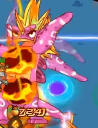
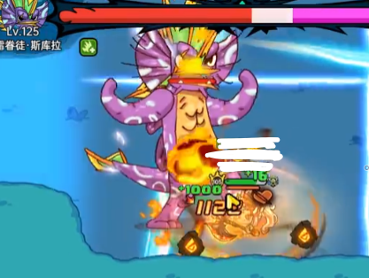
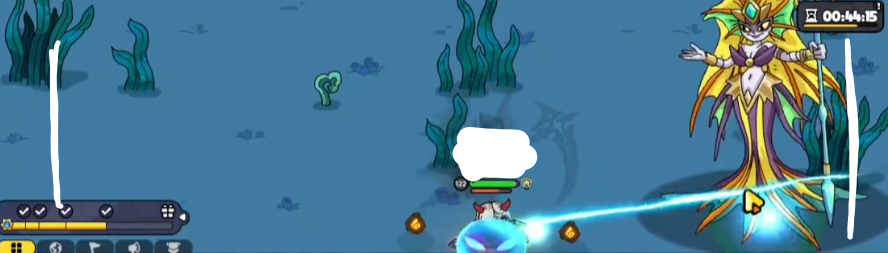
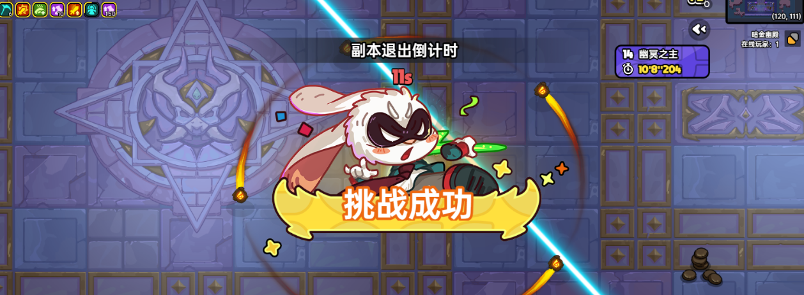

# 英勇之地手册

zzj

- [英勇之地手册](#英勇之地手册)
  - [常规boss与副本](#常规boss与副本)
    - [女武挂机仙人掌](#女武挂机仙人掌)
    - [女巫挂机仙人掌](#女巫挂机仙人掌)
    - [单速刷甲虫](#单速刷甲虫)
    - [纯挂机甲虫](#纯挂机甲虫)
    - [自动镰刀挂机甲虫](#自动镰刀挂机甲虫)
    - [雪人1](#雪人1)
    - [雪人2](#雪人2)
    - [雷龙](#雷龙)
    - [潮汐](#潮汐)
    - [冥王3\_圣骑](#冥王3_圣骑)
    - [Expired冥王3\_木乃伊(2024-09-06 木乃伊陨落)](#expired冥王3_木乃伊2024-09-06-木乃伊陨落)
    - [极雷 泽拉斯](#极雷-泽拉斯)
    - [万毒](#万毒)
  - [清体BOSS](#清体boss)
    - [2星蛾子](#2星蛾子)
    - [1星骨龙](#1星骨龙)
    - [2星骨龙](#2星骨龙)
    - [2星螃蟹](#2星螃蟹)
  - [爬塔](#爬塔)
    - [12层仙人掌](#12层仙人掌)
    - [13层雪人](#13层雪人)
    - [14层冥王](#14层冥王)
    - [15层女神](#15层女神)
  - [守卫莉娅](#守卫莉娅)
  - [组队黑榜](#组队黑榜)

## 常规boss与副本

### 女武挂机仙人掌

狂战士

**弹弓 攻击旗 150牛**

**荒漠妖花项链 至高戒指 冥王衣 雷龙鞋**

需要开镰刀

等级不够高可以boss左下先吃个加攻速buff，然后虫刀赶路

开局让boss扔个球，然后绕开贴脸弹弓完事儿

据说这套现在也能挂机仙人掌，130级测试能打

站在 171(靠近170) 110(靠近111)的位置，提前开镰刀弹弓弹就行

### 女巫挂机仙人掌

女巫

**异度旋刃 毒雾发生器 法老杖/攻击旗/150牛**

**蛾子项链/深海 万毒戒指 蛾子衣服 雷龙鞋/古树鞋**

稳定等级暂时未知

147级测试不需要开镰刀，求稳直接都开镰刀

交替使用技能，技能cd就用毒镖自动攻击

### 单速刷甲虫

任意角色

**章鱼书 散雷弓 150牛/攻击旗**

**深海/骨龙 至高戒指 冥王套**

开镰刀更快

赶路去boss时候雷弓射野怪攒层数

破盾放触手+冥王闪，触手间隙雷弓a续层数

破盾后闪+散

### 纯挂机甲虫

**章鱼书 攻击旗 150牛**

**深海 至高戒指 冥王衣 稻草鞋**

输出宠物全部激活灵契

X轴坐标控制在甲虫喷火之下

Y轴坐标34-35

最低109级~~木乃伊~~可稳定，870攻击

1级卖12狗粮109

### 自动镰刀挂机甲虫

**章鱼书 攻击旗 150牛**

**深海 至高戒指 冥王衣 稻草鞋**

不需要宠物灵契

开镰刀的攻击力下界是729，100级好像就够，目测不够100都能打

### 雪人1

大脚掉落物为，冰杖，雪人衣服，戒指

小脚掉落物为，风枪，雪人鞋子，项链

根据最后击杀的那只算掉落物

**贝塔火斧 后台龙 暴击浮游**

**深海 虫戒 蝙蝠衣 草鞋**

如先杀大脚，被冰冻前大脚放击退冰刺的话先去小脚保证解冻

现在被冻以后不会直死，扣血量大概7000

怪放四周弹幕时，不要站在怪脚下乱动吃满伤害

### 雪人2

小恶魔

**章鱼书 后台龙 5浮游**

**深海 虫戒 蝙蝠衣 草鞋 / 或冥王套**

大脚的仇恨为角色右侧有只眼睛，小脚的仇恨为角色左侧有只眼睛

开局有大脚仇恨的人，把大脚拉到打boss区域的下方那个坑里

小脚尽量往上方拉

出现冰冻时，所有没被冻的人过去解救

小脚释放2圈风墙时，如果穿的冥王套可以闪过风墙，没穿冥王套就走位时注意不要走到墙上被弹飞

大脚释放尖刺的时候，最好一点一点移动，给自己留出充足的走位空间

将大小脚都打成丝血再对其中一只进行击杀，存活的那只会回半血

### 雷龙

角色任意

**贝塔火斧 后台龙 3/5浮游**

**深海 虫戒 蝙蝠衣 草鞋**

拉怪到左下角开转

出现雷池需要往左侧通道处走躲一下

boss扔出来持续存在几秒的雷球，不要踩在上边不动

地上有电线移动，迎着电线来的方向走，防止吃到多段伤害

boss出电线风车转的时候，站在boss脚右侧，电线转到boss左脚时，向左侧走去，大概率不受伤

### 潮汐

角色任意

**减体电棍 回体圣杯 攻击旗子**

**深海 虫戒 蝙蝠衣 雷龙鞋**

去boss的路从最右边贴墙下来，萌新右下角挂机

去拉怪前提前上镰刀

打boss时完全不能用技能

拉怪到最下边3草处，和boss左右换位

boss吐那个长脸的球时，要留些体力来吸血+打虫戒盾

### 冥王3\_圣骑

待总结

圣骑士

**异度旋刃 cd虫刀/减伤圣杯 5浮游/反转浮游**

**蛾子项链 炽焰焚天戒指 蛾子衣服 古树鞋/女神鞋**

- 1阶段：
  
  待补充

- 2阶段：
  
  一进2阶段，把虫刀换成圣杯

  2阶段末，即冥王就剩1-2管血的时候，装备换成古树套/无畏套，圣杯换成三生雷影

- 3阶段：
  
  一进3阶段，所有人最好集中站到镰刀正下方或者正上方，然后把虫标丢出去，然后三生雷影开技能普攻

  小飞标亮的时候，集体往镰刀方向走，

### Expired冥王3\_木乃伊(2024-09-06 木乃伊陨落)

木乃伊，最少3个持续不死稳定输出的

高配：

**Cd法老杖 减伤圣杯/旗子(攻击或回血) 5浮游**

**万毒戒指项链 法老衣 骨鞋**

等级太低可用无畏鞋/女神鞋

这套128级有19000的血

低配：

**异度旋刃 王国盾/圣杯 浮游**

**虫戒 骨龙项链 蛾子衣服 无畏鞋/女神鞋**

可能由于体力消耗不好吸血，没f时需要走位

注：

开局回血+镰刀

局中满血也要不时普攻，暴击续镰刀，镰刀增伤与取消碰撞体积，增大容错

掉血了就开法老杖的普攻，万毒套有回血

- 1阶段:

  大家入场最好一起靠近冥王，让第一波如果冥王放飞镖能被f炸

  第一波飞镖最好4人都重合冥王脚下开f

  站冥王脚下无脑用武器技能

  法老杖使用技能的位置最好在boss正脚下

  有大波小飞镖时，多人站冥王脚下集中一点，开木乃伊技能

  如果有圆圈飞镖，但是没有f，站在圆内左侧，小飞镖亮时向右走

  横排飞镖没有f在飞镖亮时轻微单方向走动

- 2阶段:

  这个阶段直接就不要开f了，反正基本不会残血，以确保3阶段有f

  冥王转12阶段的地方会出现冥王标志

  

  冥王给人炸弹的时候，带炸弹的人远离，其余的人踩在地上的冥王标志中，有绿圈

  

  没炸弹的人最好靠近绿圈的边缘，远离炸弹人的一侧，给大家提高容错

  ***如何快速判断炸弹是否在自己身上？左右抖动，看自己是不是圆心***

  若因自己失误给队友炸死了，需要用自己的复活币复活队友

  若队友失误炸死我们，不要自己复活，等失误的人复活，没人复活就等时间自动退出

  冥王标志上有时会出现一圈飞镖，用浮游转，或有人带毒镖就丢毒镖，或法老杖技能扔绿圈里，不要直接莽进去

  2阶段末，不要提前换毒镖，需要法杖的小木乃伊给3阶段回盾提高容错

  2阶段末，队友输出不足时，冥王有可能卡timing正好放第四次炸弹并吸人，优先躲炸弹

  2阶段末，最好在冥王转阶段的时候，站在冥王脚下

- 3阶段:

  必须有f，站在大镰刀脚下，一看到出飞镖就开f

  F结束之后可以切个毒镖丢出去并普攻补次数，次数差比较多的话，丢完毒镖后切三生雷影开技能普攻

### 极雷 泽拉斯

最好3小恶魔1吟游

4小恶魔最好大家都会打，不然打的慢，会打的人需要打的更久，拖久了可能浪费币子

**章鱼书 后台龙 3浮游**

**深海 至高戒指 潮汐套(备着骨套)**

有待尝试 **深海 虫戒 蝙蝠衣服 草鞋** 这套吸血稳定，并且有虫戒容错理论上更高，并且挨打以后身上有debuff会触发蝙蝠衣服的25%减伤

开局回血，上永续镰刀，浮游调最大

同色的人站的离boss更近些

所有人站位最好站一起，站在boss正左或正右，浮游开最大正好能挂到boss的地方

一旦受伤，都会受到重伤减疗的debuff，但是持续时间不长，注意debuff消除后再进行回血

Boss不动我们不用动，boss一动我们就先小碎步预判走位，判断boss技能再进行走位

注意小恶魔cd基本与泽拉斯开盾同步，有盾不能吸血，注意开骨套时机，除非人多破盾快

boss刚冲刺完可以放俩触手直接换骨套，给全队回血

脱骨套不会直接失去回血buff，可以开完技能秒换回，不过开背包影响输出专注度，可能来不及吸血，还是血量健康以后再换回

boss血条下边会标出boss拥有的白球与黑球的数量，
白球控制boss冲刺的段数(白球数量 + 2)和boss的防御，
黑球控制boss的攻击（大概，未求证，仅凭印象）

boss有时会把自己身上的球都丢出来，角色脚下有球的情况下，需要去和boss扔出来的球贴贴，抵消掉boss的球。虽然会受伤，但是要踩。
优先踩白色的球，附近没白球再踩脸上的黑球，自己残血的话，离球远点，回血优先，否则队友踩了球是范围爆炸，会受伤
踩同色球和异色球有什么区别，还不清楚

如果死了以后，boss正好也死了，不需要交币子复活，机制会自动复活，时间够开战利品和更换万毒装备

具体boss技能解读：

- Boss举双手是天降雷球

  
  
  - 如果队友之前都站在一起的，直接转圈走到boss另一边就行

  - 如果队友之前有没站在一起的，走位之前要注意不要走到附近队友的天降雷球上

- Boss身体向后斜，举起一只手，是要出链子拉人

  
  
  - 原地附近小碎步单方向蠕动就行，注意不要走到队友脸上把本来瞄准队友的链子吃了

- Boss侧过脸，摆出冲刺动作，就是要冲刺了

  
  
  - 可以直接开潮汐，一旦发现开冲就开潮汐，开晚了虽然当下死不掉，但是会吃重伤debuff削减大量潮汐的回血，需要后边想办法回血补救

  - 也可以以boss为圆心，做圆弧走位，就可以躲过冲刺，无法走位时或boss在屏幕外但仍在冲刺再开潮汐。原理是boss是直线冲刺，圆弧走位最好躲
  
    绕圈这种躲法的好处是能把潮汐的回血容错留给除了冲刺的其他地方，减少了换骨套容易出现的失误；坏处是我们自己的容错高了，但是没有骨套的团队吸血，不会玩的队友的容错就低了

  - boss冲刺结束后，可选择切骨套给团队进行集体吸血

- Boss不侧脸，摆出类似冲刺动作的，是boss的普通移动

  

### 万毒

在极雷开完战利品后，进入万毒副本之前要把装备更换完毕

**章鱼书 后台龙 5浮游**

**深海 至高戒 骨套**

站位在地图右上角的左下那一格中心靠右的位置，具体坐标待补充

交替使用骨套

一般输出够，打得快的话，不会进入毒条环节

boss毒条满了以后进行蠕动走位，蠕动的最好慢一点，如果换方向蠕动要快一点

boss在消耗毒条的阶段，如果死了不要复活，等毒条要结束了再复活，然后快速回到打boss的位置

如果有人带旗子了，给打boss点和boss中间插个旗子挡伤害

## 清体BOSS

~~森林全用木乃伊吧，版本答案。2024-09-06，木乃伊已死~~

通用角色：斯巴达、吟游

### 2星蛾子

方式1

**章鱼书 后台龙 5浮游**

**深海项链 虫戒 潮汐套**

方式2

**散射雷弓  cd沙漏 镐子**

**深海项链 至高戒 冥王套**

时刻躲避boss射出的禁锢网，如果有带旗子，可以放旗子挡boss射出的禁锢网

小圈为天降禁锢网与单词伤害，大圈为毒池

别踩毒池！如果可能尽量贴着毒池走，使毒池集中，留出大面积的走位空间

方式1大法：

无脑用章鱼书，龙刀好了就用，浮游开最大刮boss

方式2打法：

有散雷就冥王闪到蛾子脸上开散，开完散切沙漏回cd，并离蛾子远点，地上毒池多就用镐子走位

没散的时候普攻蛾子叠雷弓被动

### 1星骨龙

抗：

~~木乃伊~~

~~**法老杖 减伤圣杯 5浮游**~~

 ~~**万毒项链/深海/巨人 虫戒 法老衣服 古树鞋/雷龙鞋**~~

~~法老杖持续普攻，放技能~~

斯巴达

**雷拳 减伤圣杯 5浮游**

**巨人 树心戒/虫戒 雷龙衣服 古树鞋/雷龙鞋**

站骨龙脚下

蓄力雷拳补护盾

躲左右半圆击退技能

1星的打到后边有时候扛不住，不知道为啥，可能是输出打的慢

输出：

**减体电棍 玄月/攻击旗 150牛**

**深海项链/至高项链 虫戒 潮汐衣服 雷龙鞋**

一般队友会带旗子，2号武器位可以带玄月/巨螯之钳来控制史莱姆

站boss正下边用电棍电，需要躲左右半圆击退技能

如果没穿潮汐衣服，在史莱姆出现前需要提前恢复体力

第一波进去有多个史莱姆，用玄月控制住集中输出

第二波出了大史莱姆最好轮流使用电棍技能控制史莱姆，或者有**魔法师**开技能给冻在原地

### 2星骨龙

抗的话2人换抗，有冰盾木乃伊能单抗

输出：

**减体电棍 沙漏 150牛/攻击旗子/回体圣杯**

**深海项链/至高项链 虫戒 潮汐衣服 雷龙鞋**

开局开镰刀

看队友的旗子和圣杯情况来决定3号武器带什么

沙漏够的话2号武器位也可以带玄月/巨螯之钳来控制史莱姆

沙漏cd好了就给抗的木乃伊用

站boss正下边用电棍电，需要躲左右半圆击退技能

第一波进去有多个史莱姆，用玄月控制住以后用电棍技能进行短暂控制集中输出

第二波出了大史莱姆最好轮流使用电棍技能控制史莱姆，或者有**魔法师**开技能给冻在原地

### 2星螃蟹

**深海 虫戒 潮汐套**

**章鱼书 后台龙 5浮游**

破盾的时候，站在螃蟹正左或正右，水平移动碰浅蓝气泡来破盾

被boss拍飞出了气泡圈的话，切换虫刀回到战场

后台龙cd好了就用

队友都会打输出够的情况，破1次盾即可打死螃蟹

残血了或者碰到无法走位的情况就交潮汐或吟游技能回血

螃蟹吹/吸人之后，会有内圈斩和外圈斩，内圈斩有击退，会给角色击退出气泡圈，外圈斩没击退，伤害快到半管血，可以扛

## 爬塔

爬塔都提前上好宠物，差伤害差的不多可以开小号在外边吃口饭再进去

### 12层仙人掌

女巫

**异度旋刃 毒雾发生器 法老杖**

**蛾子项链/深海 万毒戒指 蛾子衣服 雷龙鞋/古树鞋**

开局先上镰刀，站在boss脚下轮流放武器技能站撸boss

### 13层雪人

小恶魔

**贝塔火斧 后台龙 5浮游**

**深海 虫戒 蝙蝠衣服 草鞋/火鞋**

先转大脚，地上的火堆可以解冻，龙刀好了就用

### 14层冥王

圣骑士

**三生雷影&生命药剂 5浮游 虫刀&异度旋刃**

**深海 焚天戒指 雪人套**

宠物：火鸟 冥王 **蒸饺**

进图正常回满血上镰刀，浮游开最大

进场时候最好直接虫刀闪到场地中间，不然冥王上来卡视角打你一整套直接残血

站位浮游外圈正好刚挂到冥王，绕着冥王转圈，并用三生雷影一直普通冥王与小飞标

有无法走位躲开的时候，若有雪人的盾，吃完伤害补盾，没盾提前补盾

残血以后，手动切换生命药剂回口血

清理小飞标的时候，一定不要走回头路，因为小飞标瞄准的是角色的位置，只要蒙住头走就不会被集火

除了打的慢，要10分钟了，容错很高，怀念木乃伊的复炸

1阶段末期，即剩半管到1管血时候，把虫刀换成异度旋刃

进入2阶段，站在大镰刀的正上方或者正下方，先丢出去毒镖，然后用三生雷影开技能普攻

小飞标亮的时候，径直走向boss的另一侧

感觉要被集火了就开f无敌几秒

### 15层女神

女巫

**蛾子项链 万毒戒指 蛾子衣服 骨鞋**

**毒手/毒镖 毒雾发生器 法老杖**

武器技能不着急放，不要cd一好就放，女神冲刺完不再冲的时候集中交一波武器技能

放全部武器技能最好搞个鼠标宏提前测试一下稳定点，防止用武器技能时候，分心，走位失误

出毒心眼的时候，往远离女神的方向走就行，触发心眼女神的攻击范围差不多就是场地宽度的一半

2阶段注意：

全程记得普攻女神补伤害，不然会出现经常就剩一点血就成功的情况

女神出招4还是5次便开始1次冲刺

女神冲刺的时候每次碰到角色或者召唤物时候，都会额外多冲一段，最高3段

等女神冲刺完了站定了，再一并丢技能上去

终于拿下！

补档扔全部武器技能宏设置：

停止自动攻击->使用人物技能->3个武器轮流丢技能->切回主武器->开启自动攻击

切武器0.4s延迟，切完武器使用技能0.15s延迟，实测这一套比较稳定

## 守卫莉娅

这个从评论区复制来的
单刷：
主 c 角色◇女巫
辅助角色◇法师、女巫
主 c 武器◇浮游、章鱼书、鞭子
如果只是为了过20关可以把章鱼书换雷拳
强化优先级◇100暴击＞爆伤＝技能伤害＝百分百攻击力＞2000移速＞加宝石

辅助武器：冰柱、鞭子、沙漏、冰杖（有强化才拿◇
强化优先级◇建筑血量＞技能 cd ＞建筑伤害＞其他

高级盒子全部优先给主 c ，神话盒子主 c 开到浮游＋章鱼书之后其他人再拿后期高级宝箱和商人都会出神话盒子 
猛犸象是冻不住的◇要用冰柱子卡。
5、10、15、20、24关的帕祖祖要出去用拉仇恨
挂机的人在主c不缺资源后，拿材料补墙

## 组队黑榜

| 名称 | 副本 | 原因 |
| :--- | :----: | ---: |
| 椿棠影 | 冥3 | 1炸3直接跑了 |
| 老属 | 冥3 | 1炸3直接跑了 |