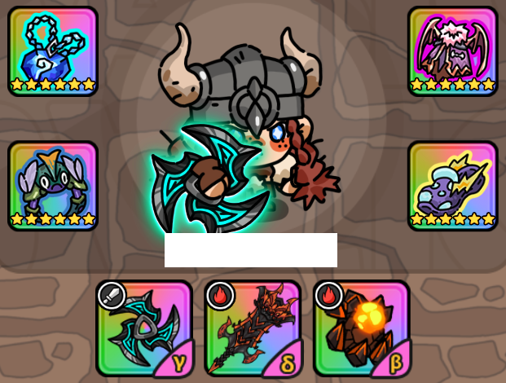
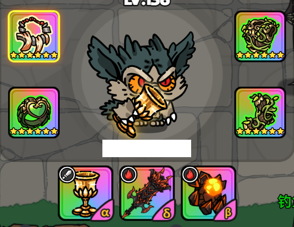
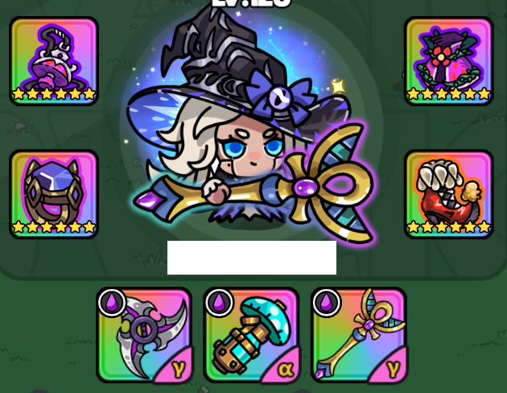
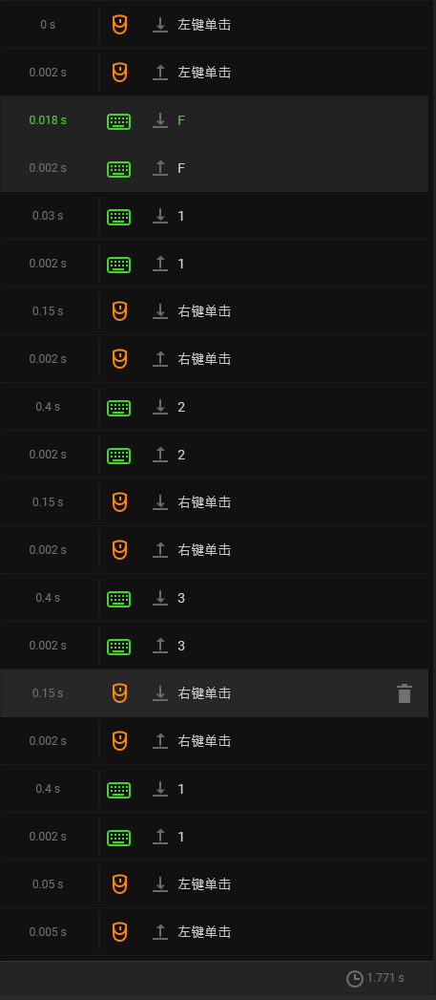
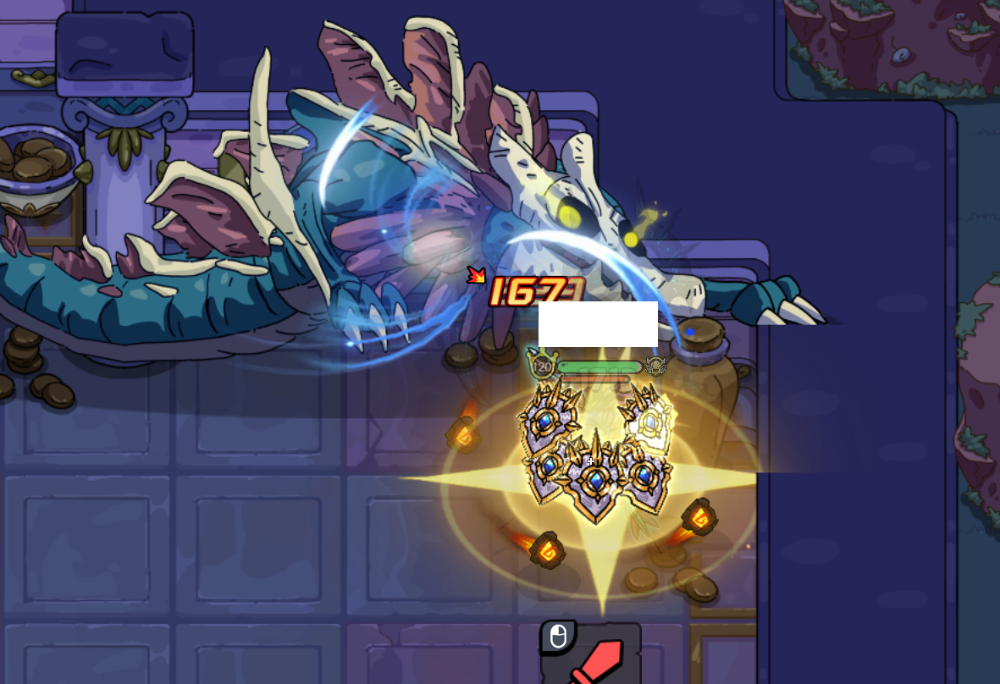
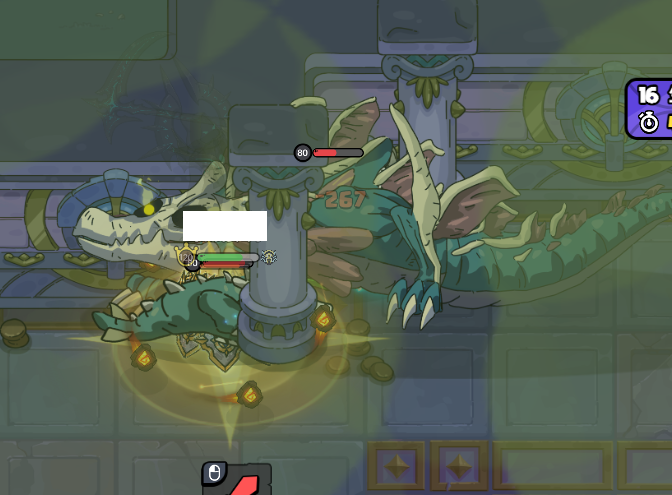

# 英勇之地手册

zzj

- [英勇之地手册](#英勇之地手册)
  - [常规boss与副本](#常规boss与副本)
    - [女武挂机仙人掌](#女武挂机仙人掌)
    - [女巫挂机仙人掌](#女巫挂机仙人掌)
    - [单速刷甲虫](#单速刷甲虫)
    - [挂机甲虫](#挂机甲虫)
    - [蝙蝠](#蝙蝠)
    - [法老王](#法老王)
    - [雪人1](#雪人1)
    - [雪人2](#雪人2)
    - [雪人3](#雪人3)
    - [雷龙](#雷龙)
    - [潮汐](#潮汐)
    - [冥王3\_圣骑](#冥王3_圣骑)
    - [冥王3\_龙人](#冥王3_龙人)
    - [Expired冥王3\_木乃伊(2024-09-06 木乃伊陨落)](#expired冥王3_木乃伊2024-09-06-木乃伊陨落)
    - [极雷 泽拉斯](#极雷-泽拉斯)
    - [优化版极雷教程](#优化版极雷教程)
    - [万毒](#万毒)
  - [清体BOSS](#清体boss)
    - [2星蛾子](#2星蛾子)
    - [1星骨龙](#1星骨龙)
    - [2星骨龙](#2星骨龙)
    - [2星螃蟹](#2星螃蟹)
    - [仙人掌3星](#仙人掌3星)
    - [古树团本](#古树团本)
  - [爬塔](#爬塔)
    - [12层仙人掌\_目前不稳定](#12层仙人掌_目前不稳定)
    - [12层仙人掌](#12层仙人掌)
    - [13层雪人](#13层雪人)
    - [14层冥王](#14层冥王)
    - [15层女神](#15层女神)
    - [16层骨龙](#16层骨龙)
    - [17层螃蟹](#17层螃蟹)
    - [18层潮汐](#18层潮汐)
    - [19层雪人](#19层雪人)
    - [20层法老王](#20层法老王)
  - [守卫莉娅](#守卫莉娅)
  - [组队黑榜(偶尔更新，队友好坏全看运气，优先看满级+武器积分高的，面板好的cs也很多)](#组队黑榜偶尔更新队友好坏全看运气优先看满级武器积分高的面板好的cs也很多)
  - [PVP环节](#pvp环节)
    - [图腾蛋](#图腾蛋)
    - [雷级蛋\_门](#雷级蛋_门)
    - [雷级蛋\_带容错](#雷级蛋_带容错)
    - [肉史莱姆](#肉史莱姆)
    - [游龙女武](#游龙女武)
    - [厨子](#厨子)
    - [火弓鸡](#火弓鸡)
    - [魔法师](#魔法师)

## 常规boss与副本

### 女武挂机仙人掌

狂战士

- 武器 : **弹弓 攻击旗 150牛**
- 装备 : **荆棘项链/荒漠妖花项链/深海 至高戒指 冥王衣 雷龙鞋**

需要开镰刀

开局让boss扔个球，然后绕开贴脸弹弓完事儿

如果完全挂机，站在 171(靠近170) 110(靠近111)的位置，提前开镰刀弹弓弹就行

### 女巫挂机仙人掌

女巫

- 武器 : **异度旋刃 毒雾发生器 毒手/法老杖/攻击旗/150牛**
- 装备 : **蛾子项链 万毒戒指 蛾子衣服 雷龙鞋/古树鞋/草鞋**

如果带的毒手，就可以草鞋，体力正好够

147级测试不需要开镰刀，求稳直接都开镰刀

交替使用技能，技能cd就用毒手/毒镖自动攻击

### 单速刷甲虫

任意角色

- 武器 : **章鱼书 散雷弓 150牛/攻击旗**
- 装备 : **深海/骨龙 至高戒指 冥王套**

开镰刀更快

赶路去boss时候雷弓射野怪攒层数

破盾放触手+冥王闪，触手间隙雷弓a续层数

破盾后闪+散

### 挂机甲虫

- 武器 : **章鱼书 攻击旗 150牛**
- 装备 : **深海 至高戒指 冥王衣 稻草鞋**

不开镰刀的话，输出宠物全部激活灵契

开镰刀的攻击力下界是729，目测不够100都能打，不需要宠物

X轴坐标控制在甲虫喷火之下

Y轴坐标34-35

最低109级~~木乃伊~~可稳定，870攻击

1级卖12狗粮109

### 蝙蝠

女武神

- 装备 : **深海 虫戒 蝙蝠衣 雷龙鞋**
- 武器1 : **盘子 后台龙 3/5浮游**
- 武器2 : **暴击虫头 后台龙 150牛**

盘子的改造无所谓，综合体验武器2更稳定，并且便于沙漠3刷boss

浮游的大小为：从最小浮游开始，扩大5下；即浮游默认大小，正好刮到boss的正脚下

站位在boss左下30度或45度正好浮游能挂到boss的地方，就不用动了a

第一波，在外边开完镰刀上坐骑，把镰刀换成盘子，切换到龙刀

骑着坐骑走到boss脸上，开龙刀 -> 切换盘子 -> 开盘子 -> 自动攻击 -> 女武f

这一套下来小蝙蝠就清干净了

剩下的就是贴贴boss，有啥扔啥就行，站位在boss左下30度或45度正好浮游能挂到boss的地方，就不用动了

差不多90层debuff左右正好打死boss

据说手动一次，后边的就能全自动，没测试

### 法老王

角色与宠物配置

- 角色 : 狼人
- 宠物 : 泽拉斯、牛、蒸饺

阶段 1

- 武器 : **章鱼书、后台龙、5浮游**
- 装备 : **骨龙项链、虫戒、蝙蝠衣、草鞋**

战斗策略

1. 浮游配置 : 将浮游范围调整至最大，并提前装备永续镰刀。
2. 站位与输出 : 围绕Boss移动，保持在浮游最大范围内，使其持续输出。使用章鱼书技能释放章鱼触手，触手会在Boss移动时持续对其造成伤害。
3. 龙刀技能 : 当龙刀技能冷却完成后，立即使用以加快输出。
4. 棺材处理 : Boss会定期生成棺材，未打破的棺材会减缓靠近的角色速度。尽早在棺材旁释放章鱼触手快速打破。
5. 全屏拳头技能躲避 : 当Boss施放全屏拳头技能时，需迅速开f变狼躲入场地上方的两个小房间。在此之前，可在Boss脚下释放章鱼触手，防止其长时间不受攻击导致回血。此技能共有5波攻击。
6. 狼人形态与恢复 : 如果血量过低，可开启狼人F技能，进入狼形态恢复满血。躲避完全屏拳头攻击后可恢复成人形继续战斗。
7. 木乃伊处理 : 若有小木乃伊进入小房间，使用章鱼书在脚下释放触手，并用龙刀普通攻击迅速消灭。

阶段 2

- 武器 : **减伤圣杯、后台龙、5浮游**
- 装备 : **巨人项链、树心戒指、古树套装**

阶段切换及战斗策略

1. 装备与武器切换 : 当Boss血量下降至42-43管时，提前更换为阶段2的装备与武器，将浮游范围调整至最小。确保手中持有火属性武器（后台龙或浮游）后，进入狼人形态。
2. 输出策略 : 围绕Boss移动，对其或小木乃伊开启自动攻击。主要输出来源为浮游的持续伤害和后台龙刀的触发技能。
3. 血量管理 : 当血量下降时，可拉开与Boss的距离，优先攻击小木乃伊以恢复生命值。树套技能冷却后可立即使用。
4. 躲避技能 :
   - 地刺技能 : Boss释放地刺时，尽量保持移动，避免被禁锢，从而避免Boss的连击致死；若被地刺控制，并且被小木乃伊包围，开树套技能回血防止被秒或者触发树套导致容错变低。
   - 激光攻击 : Boss释放激光时，保持与其距离，避免硬吃伤害。
5. 遁地阶段处理 :
   - 护盾机制 : Boss进入遁地状态时会生成护盾，此阶段Boss无敌。每击杀一个小木乃伊或破坏一个棺材，Boss会损失1/3的护盾。当护盾完全消失后，遁地阶段结束。
   - 风筝策略 : 若自身血量较低，可在遁地阶段利用风筝策略拉扯Boss，触发装备和宠物的回血效果。
   - 引导Boss钻出 : Boss遁地时会追踪玩家，可走到指定位置站定，诱导Boss在该位置钻出。当Boss靠近时，迅速走开即可。
6. 注意事项 : 若有队友参与战斗，务必让他们远离场地门口，因为Boss在遁地阶段可能会追踪门口的玩家。一旦Boss追出场地，战斗将重置。

### 雪人1

大脚掉落物为，冰杖，雪人衣服，戒指

小脚掉落物为，风枪，雪人鞋子，项链

根据最后击杀的那只算掉落物

- 武器 : **贝塔火斧 后台龙 暴击浮游**
- 装备 : **深海 虫戒 蝙蝠衣 草鞋**

如先杀大脚，被冰冻前大脚放击退冰刺的话先去小脚保证解冻

现在被冻以后不会直死，扣血量大概7000

怪放四周弹幕时，不要站在怪脚下乱动吃满伤害

### 雪人2

小恶魔

- 武器 : **贝塔火斧/章鱼书 后台龙 5浮游**
- 装备 : **深海 虫戒 蝙蝠衣+草鞋 / 冥王套**

大脚的仇恨为角色右侧有只眼睛，小脚的仇恨为角色左侧有只眼睛

开局有大脚仇恨的人，把大脚拉到打boss区域的下方那个坑里，人站在坑里往坑的中间左边走，能卡在墙里一半，这样不会被大脚的冰刺击退

小脚尽量往上方拉

出现冰冻时，被冰冻的人往所有人中间走（防止打大脚的人帮你解冻完来不及回去拉怪），所有没被冻的人过去解救。

基本上救完解冻，大脚就会重新跳一下，需要直接回到坑里那个位置

小脚释放2圈风墙时，如果穿的冥王套可以闪过风墙，没穿冥王套就走位时注意不要走到墙上被弹飞

大脚释放尖刺的时候，最好一点一点移动，给自己留出充足的走位空间

将大小脚都打成丝血再对其中一只进行击杀，存活的那只会回半血

### 雪人3

即将发布

### 雷龙

角色任意

- 武器 : **贝塔火斧 后台龙 3/5浮游**
- 装备 : **深海 虫戒 蝙蝠衣 草鞋**

拉怪到左下角开转

拉怪技巧：拿着章鱼书，站在左下角需要boss来的地方，一直使用章鱼书技能打boss，既能回血又能回盾，boss来了一定先是雷池技能，在躲雷池时，顺手上了永续镰刀换上贝塔火斧准备开砖

出现雷池需要往左侧通道处走躲一下，注意不要站在多个雷池的接壤处吃到多段雷池伤害而暴毙

boss扔出来持续存在几秒的雷球，不要踩在上边不动

地上有电线移动，迎着电线来的方向走，防止吃到多段伤害

boss出电线风车转的时候，站在boss脚右侧，电线转到boss左脚时，向左侧走去，大概率不受伤

### 潮汐

角色任意

- 武器 : **减体电棍 回体圣杯 攻击旗子**
- 装备 : **雷鸣之息 虫戒 蝙蝠衣 雷龙鞋**

去boss的路从最右边贴墙下来，萌新右下角挂机

去拉怪前提前上镰刀

打boss时完全不能用技能

拉怪到最下边3草处，和boss左右换位

boss吐那个长脸的球时，要留些体力来吸血+打虫戒盾

### 冥王3\_圣骑

待总结

圣骑士

- 武器 : **异度旋刃 cd虫刀/减伤圣杯 5浮游/反转浮游**
- 装备 : **蛾子项链 炽焰焚天戒指 蛾子衣服 古树鞋/女神鞋**

- 1阶段：
  
  走位躲飞镖，浮游刮飞镖

  boss吸人以后，在boss开始挥砍时用虫刀闪开，注意头顶有炸弹的不要炸到队友

- 2阶段：
  
  一进2阶段，把虫刀换成圣杯

  2阶段末，即冥王就剩1-2管血的时候，装备换成古树套/无畏套，圣杯换成三生雷影

- 3阶段：
  
  一进3阶段，所有人最好集中站到镰刀正下方或者正上方，然后把虫标丢出去，然后三生雷影开技能普攻

  小飞镖亮的时候，集体往镰刀方向走，

### 冥王3_龙人

用龙人的移动一定距离给附近的友方回血这个被动，队伍里有4龙人时候，能够触发高频高额治疗，但是也和圣骑一样，需要走位，不能吃太多伤害直接被秒了

### Expired冥王3\_木乃伊(2024-09-06 木乃伊陨落)

木乃伊，最少3个持续不死稳定输出的

高配：

- 武器 : **Cd法老杖 减伤圣杯/旗子(攻击或回血) 5浮游**
- 装备 : **万毒戒指项链 法老衣 骨鞋**

等级太低可用无畏鞋/女神鞋

这套128级有19000的血

低配：

- 武器 : **异度旋刃 王国盾/圣杯 浮游**
- 装备 : **虫戒 骨龙项链 蛾子衣服 无畏鞋/女神鞋**

可能由于体力消耗不好吸血，没f时需要走位

注：

开局回血+镰刀

局中满血也要不时普攻，暴击续镰刀，镰刀增伤与取消碰撞体积，增大容错

掉血了就开法老杖的普攻，万毒套有回血

- 1阶段:

  大家入场最好一起靠近冥王，让第一波如果冥王放飞镖能被f炸

  第一波飞镖最好4人都重合冥王脚下开f

  站冥王脚下无脑用武器技能

  法老杖使用技能的位置最好在boss正脚下

  有大波小飞镖时，多人站冥王脚下集中一点，开木乃伊技能

  如果有圆圈飞镖，但是没有f，站在圆内左侧，小飞镖亮时向右走

  横排飞镖没有f在飞镖亮时轻微单方向走动

- 2阶段:

  这个阶段直接就不要开f了，反正基本不会残血，以确保3阶段有f

  冥王转12阶段的地方会出现冥王标志

  

  冥王给人炸弹的时候，带炸弹的人远离，其余的人踩在地上的冥王标志中，有绿圈

  

  没炸弹的人最好靠近绿圈的边缘，远离炸弹人的一侧，给大家提高容错

  ***如何快速判断炸弹是否在自己身上？左右抖动，看自己是不是圆心***

  若因自己失误给队友炸死了，需要用自己的复活币复活队友

  若队友失误炸死我们，不要自己复活，等失误的人复活，没人复活就等时间自动退出

  冥王标志上有时会出现一圈飞镖，用浮游转，或有人带毒镖就丢毒镖，或法老杖技能扔绿圈里，不要直接莽进去

  2阶段末，不要提前换毒镖，需要法杖的小木乃伊给3阶段回盾提高容错

  2阶段末，队友输出不足时，冥王有可能卡timing正好放第四次炸弹并吸人，优先躲炸弹

  2阶段末，最好在冥王转阶段的时候，站在冥王脚下

- 3阶段:

  必须有f，站在大镰刀脚下，一看到出飞镖就开f

  F结束之后可以切个毒镖丢出去并普攻补次数，次数差比较多的话，丢完毒镖后切三生雷影开技能普攻

### 极雷 泽拉斯

**NOTE** : 本节是初版极雷教程，是一边练习打极雷一遍总结的，更加口语化，但是叙述缺乏逻辑，不太便于阅读，但可能包含更多细节

阵容最好是4小恶魔或3小恶魔+1吟游

女巫是不打万毒的，如果想打万毒的话，组队阶段直接踢掉女巫

- 武器 : **章鱼书 后台龙 3浮游**
- 传统装备 : **深海 至高戒指 潮汐套(备着骨套)**
- 稳健装备 : **骨项链 虫戒 蝙蝠衣服 草鞋**

蝙蝠衣这套吸血稳定，并且有虫戒容错更高，带冥王宠物97暴击基本当满暴，并且挨打以后身上有debuff会触发蝙蝠衣服的25%减伤，超级稳定，冲刺靠圆弧走位躲就行，硬扛都不死的

开局回血，上永续镰刀，浮游需要调到最大

同色的人站的离boss更近些，会增加包括自己在内所有人的容错！！！！

所有人站位最好站一起，站在boss正左或正右，浮游开最大正好能挂到boss的地方

走位时注意不要主动把脚下的球和boss脚下的球接触，会给boss喂一个雷球，属性为自己脚下球的颜色

一旦受伤，都会受到重伤减疗的debuff，但是持续时间不长，注意debuff消除后再进行回血

Boss不动我们不用动，boss一动我们就先小碎步预判走位，判断boss技能再进行走位

注意小恶魔cd基本与泽拉斯开盾同步，有盾不能吸血，注意开骨套时机，除非人多破盾快

boss刚冲刺完可以放俩触手直接换骨套，给全队回血

脱骨套不会直接失去回血buff，可以开完技能秒换回，不过开背包影响输出专注度，可能来不及吸血，还是血量健康以后再换回

boss脚下的大球，同色相撞会击退角色并互相抵消，异色相撞会有范围眩晕效果以及范围伤害，这也是让同色的人站的离boss更近一点的原因，否则boss开始冲刺，全晕吃满伤害

再重申一遍！**同色的人站的离boss更近些，会增加包括自己在内所有人的容错！！！！**

boss血条下边会标出boss拥有的白球与黑球的数量，
白球控制boss冲刺的段数(白球数量 + 2)和boss的防御，
黑球控制boss脚下的球的半径和boss的攻击

**要踩球**！！！！

boss有时会把自己身上的球都丢出来，角色脚下有球的情况下，需要去和boss扔出来的球贴贴，抵消掉boss的球。虽然会受伤，但是要踩。
优先踩白色的球，附近没白球再踩脸上的黑球，自己残血的话，离球远点，回血优先，否则队友踩了球是范围爆炸，会受伤

踩同色球会被击飞一段距离，目测是浮游开最大的半径
踩异色球好像啥事儿没有，只会受伤

如果死了以后，boss正好也死了，不需要交币子复活，机制会自动复活，时间够开战利品和更换万毒装备

具体boss技能解读：

- Boss举双手是天降雷球

  
  
  - 如果队友之前都站在一起的，直接转圈走到boss另一边就行
  - 如果队友之前有没站在一起的，走位之前要注意不要走到附近队友的天降雷球上

- Boss身体向后斜，举起一只手，是要出链子拉人

  
  
  - 原地附近小碎步单方向蠕动就行，注意不要走到队友脸上把本来瞄准队友的链子吃了

- Boss侧过脸，摆出冲刺动作，就是要冲刺了

  
  
  - 可以直接开潮汐，一旦发现开冲就开潮汐，开晚了虽然当下死不掉，但是会吃重伤debuff削减大量潮汐的回血，需要后边想办法回血补救

  - 也可以以boss为圆心，做圆弧走位，就可以躲过冲刺，无法走位时或boss在屏幕外但仍在冲刺再开潮汐。原理是boss是直线冲刺，圆弧走位最好躲
  
    绕圈这种躲法的好处是能把潮汐的回血容错留给除了冲刺的其他地方，减少了换骨套容易出现的失误；坏处是我们自己的容错高了，但是没有骨套的团队吸血，不会玩的队友的容错就低了

  - boss冲刺结束后，可选择切骨套给团队进行集体吸血

- Boss不侧脸，摆出类似冲刺动作的，是boss的普通移动

  

### 优化版极雷教程

**NOTE** : 本节对泽拉斯教程重新进行了整理，使逻辑更清晰，便于阅读

阵容推荐

最佳选择是 4小恶魔 或 3小恶魔 + 1吟游。如果打万毒，直接踢掉女巫。

装备配置

- 武器 : **章鱼书 后台龙 5浮游**
- 传统装备：**深海 至高戒指 潮汐套(骨套备用)**
- 稳健装备：**骨项链 虫戒 蝙蝠衣 草鞋**

- **蝙蝠衣**提供吸血能力，并且受伤后触发的debuff能够触发25%减伤的被动，搭配**虫戒**的护盾容错率高，配合走位躲冲刺，基本无惧除天降雷球以外的伤害。
- 带**冥王宠物**后暴击可达到97%，配合骨项链的减cd，很好的保证了输出

战斗策略

1. 基本站位：全队站在boss的正左或正右，确保 浮游开到最大 能打到boss。脚下的球与boss脚下的球同色的队员站得离boss更近一些，以增加boss冲刺时的容错率。
2. 不要让脚下的球与boss脚下的球相撞，否则会喂一个雷球给boss，喂给boss的球取决于球的颜色。
3. debuff处理：受伤后会有重伤减疗debuff，等debuff消除后再考虑是否需要切骨套回血。
4. 走位判断：boss不动时站定，boss有动作时先小碎步移动并判断boss出招，再进行直接的走位。小恶魔CD与泽拉斯开盾同步时不能吸血，注意骨套的使用时机。

骨套使用时机：

- 在boss冲刺完毕后，可以迅速切换骨套并使用技能，给全队提供高额吸血。使用完骨套技能后可以秒换回，但确保自身血量与站位安全再操作。

雷球机制

这里的球需要说明，区分为**地上可交互的球**，和**boss拥有的球**

- 地上的球包括玩家和boss脚下的球，与boss将拥有的球扔出来后的球，这些球都是互相可以通过碰撞交互的
- boss拥有的球可以通过boss血条下方有直观的数量显示

1. 球碰撞：

   地上的球互相碰撞后，两球均消失
   - 同色球相撞：角色被击退并抵消球效果。
   - 异色球相撞：造成范围眩晕和伤害。
   - 如果碰撞的球有一方是boss脚下的球，boss会获得1个玩家脚下的球，一般由走位失误造成，称为**喂球**。

2. 踩球策略：

   boss有时会将拥有的球抛出，使其成为可被碰撞的球
   - 踩球优先度：boss拥有数量大于等于4的球 > 白球 > 无球可踩离时离的近的任意球。即使会受伤也要踩，避免boss拥有太多球。

3. 白球与黑球作用：
   - 白球控制boss冲刺段数(n+2)和防御力。
   - 黑球影响boss脚下的球半径和攻击力。

再次强调：

- 集中站在boss左右，同色队员站近boss，增加团队容错。
- 别喂球，多踩球。

自动复活机制

- 如果你在boss死后仍处于可复活阶段，不需要使用复活币复活，副本机制会自动复活死亡的玩家并留有时间获取战利品与更换打万毒的装备。

boss招式详解：

- Boss举双手是天降雷球

  
  
  - 如果队友之前都站在一起的，直接转圈走到boss另一边就行。
  - 如果队友之前有没站在一起的，走位之前要注意不要走到附近队友的天降雷球上。

- Boss身体向后斜，举起一只手，是要出链子拉人

  
  
  - 原地附近小碎步单方向蠕动就行，注意不要走到队友脸上把本来瞄准队友的链子吃了。

- Boss侧过脸，摆出冲刺动作，就是要冲刺了

  
  
  - 潮汐躲法 : 可以直接开潮汐，一旦发现开冲就开潮汐，开晚了虽然当下死不掉，但是会吃重伤debuff削减大量潮汐的回血，需要后边想办法回血补救。
  - 走位躲法 : 以boss为圆心，做圆弧走位，就可以躲过冲刺。原理是boss是直线冲刺，圆弧走位最好躲。
  - boss冲刺结束后，可选择切骨套给团队提供高额吸血。

- Boss不侧脸，摆出类似冲刺动作的，是boss的普通移动

  

  - 虽然普通移动没有威胁，但需要注意不要喂球！

### 万毒

在极雷开完战利品后，进入万毒副本之前要把装备更换完毕

- 武器 : **章鱼书 后台龙 5浮游**
- 装备 : **深海 至高戒 骨套**

站位在地图右上角的左下那一格中心靠右的位置，具体坐标 117 79

交替使用骨套，如果不是语音开黑的话，看最左边队伍的血条，发现有人危了就开骨套

一般输出够，打得快的话，不会进入毒条环节

如果队友输出不够，或者少人，最好别主动使用龙刀了，不然体力不够用会面临吸血不上来的情况

boss毒条满了以后进行蠕动走位，蠕动的最好慢一点，如果换方向蠕动要快一点。目前我不能稳定躲过这个毒条，碰到了基本都是稳定交1币子

boss在消耗毒条的阶段，如果死了不要复活，等毒条要结束了再复活，然后快速回到打boss的位置

如果有人带旗子了，给打boss点和boss中间插个旗子挡伤害

## 清体BOSS

~~森林全用木乃伊吧，版本答案。2024-09-06，木乃伊已死~~

通用角色：斯巴达、吟游

### 2星蛾子

方式1

- 武器 : **章鱼书 后台龙 5浮游**
- 装备 : **深海项链 虫戒 潮汐套**

方式2

- 武器 : **散射雷弓 cd沙漏 镐子**
- 装备 : **深海项链 至高戒 冥王套**

时刻躲避boss射出的禁锢网，如果有带旗子，可以放旗子挡boss射出的禁锢网

小圈为天降禁锢网与单词伤害，大圈为毒池

别踩毒池！如果可能尽量贴着毒池走，使毒池集中，留出大面积的走位空间

方式1大法：

无脑用章鱼书，龙刀好了就用，浮游开最大刮boss

方式2打法：

有散雷就冥王闪到蛾子脸上开散，开完散切沙漏回cd，并离蛾子远点，地上毒池多就用镐子走位

没散的时候普攻蛾子叠雷弓被动

### 1星骨龙

抗：

~~木乃伊~~

~~**法老杖 减伤圣杯 5浮游**~~

~~**万毒项链/深海/巨人 虫戒 法老衣服 古树鞋/雷龙鞋**~~

~~法老杖持续普攻，放技能~~

斯巴达

- 武器 : **雷拳 减伤圣杯 5浮游**
- 装备 : **巨人 树心戒/虫戒 雷龙衣服 古树鞋/雷龙鞋**

站骨龙脚下

蓄力雷拳补护盾

躲左右半圆击退技能

1星的打到后边有时候扛不住，不知道为啥，可能是输出打的慢

找到原因了：

骨龙会释放出小蜥蜴那个技能，最好输出的人还是管一下这个小蜥蜴，骨龙咬的不疼，这个小蜥蜴巨痛，疑似会导致骨龙咬的更痛

输出：

- 武器 : **减体电棍 玄月/攻击旗 150牛**
- 装备 : **深海项链/至高项链 虫戒 潮汐衣服 雷龙鞋**

一般队友会带旗子，2号武器位可以带玄月/巨螯之钳来控制史莱姆

站boss正下边用电棍电，需要躲左右半圆击退技能

如果没穿潮汐衣服，在史莱姆出现前需要提前恢复体力

第一波进去有多个史莱姆，用玄月控制住集中输出

第二波出了大史莱姆最好轮流使用电棍技能控制史莱姆，或者有**魔法师**开技能给冻在原地

### 2星骨龙

抗的话2人换抗，有冰盾木乃伊能单抗

抗：

只换武器

- 抗时 : **雷拳 减伤圣杯 5浮游**
- 扛不住时后退 : **电棍(补点输出与控制) 森林之心/沙漏/减伤圣杯(切换使用，最后留在减伤圣杯上) 5浮游**
- 装备 : **巨人项链 虫戒/树心戒指/雷鸣裁决之环 雷龙套**

输出：

- 武器 : **减体电棍 沙漏 150牛/攻击旗子/回体圣杯**
- 装备 : **深海项链/至高项链 虫戒 潮汐衣服 雷龙鞋**

开局开镰刀

看队友的旗子和圣杯情况来决定3号武器带什么

沙漏够的话2号武器位也可以带玄月/巨螯之钳来控制史莱姆

沙漏cd好了就给抗的木乃伊用

站boss正下边用电棍电，需要躲左右半圆击退技能

第一波进去有多个史莱姆，用玄月控制住以后用电棍技能进行短暂控制集中输出

第二波出了大史莱姆最好轮流使用电棍技能控制史莱姆，或者有**魔法师**开技能给冻在原地

### 2星螃蟹

- 武器 : **深海 虫戒 潮汐套**
- 装备 : **章鱼书 后台龙 5浮游**

破盾的时候，站在螃蟹正左或正右，水平移动碰浅蓝气泡来破盾

被boss拍飞出了气泡圈的话，切换虫刀回到战场

后台龙cd好了就用

队友都会打输出够的情况，破1次盾即可打死螃蟹

残血了或者碰到无法走位的情况就交潮汐或吟游技能回血

螃蟹吹/吸人之后，会有内圈斩和外圈斩，内圈斩有击退，会给角色击退出气泡圈，外圈斩没击退，伤害快到半管血，可以扛

### 仙人掌3星

女巫

开局上镰刀

魔术鞋的使用方法：第一次使用技能原地标记飞雷神，再次使用技能回到标记位置

打法：魔术鞋上仙人掌附近，丢掉所有武器技能和角色技能，回到魔术鞋标记处，然后等cd扔下一套伤害

等cd的时候，手持虫标，简单清理一下地上的小仙人球。

唯一需要走位的：仙人掌扔大球，会秒人的，伤害非常高！

### 古树团本

- 角色选择 : 小恶魔
- 武器 : **β火斧、暴击虫头、后台龙、5/3浮游**
- 装备 : **骨项链、虫戒、蝙蝠衣、草鞋**

开局准备

1. 上镰刀buff : 开局时，确保使用永续镰刀以提高战斗持续输出能力。
2. 调整武器与浮游 : 当Boss血量下降到270之前，切换至暴击虫头，并将浮游范围调至最大。
3. 技能管理 : 重要提示 : 当Boss血量低于270时，不要使用任何技能，包括浮游技能、武器技能和角色技能。

战斗机制与应对策略

1. 地雷机制: 战斗过程中，地面会出现闪现地雷。请立即远离这些地雷，它们会造成高额伤害。
2. 笼子机制: 若队友或自己被困在笼子中，优先攻击笼子以解救队友与给自己吸血回盾。
3. 龙刀技能: 龙刀技能冷却完成后，立即使用，增强输出效率。
4. 下雨机制: 当Boss开始释放下雨技能时，迅速找到场地下方的水坑并站进去。站在水坑外会受到持续伤害。确保每个水坑只有一名玩家站入，若多人共享一个水坑时，优先让血量较多的玩家离开寻找新的水坑。附近有空水坑的话，可以普攻朝向空水坑给队友指路。
5. 结束雨季: 当所有8个水坑都被占用后，Boss将结束下雨机制。

战斗奖励

战斗结束后，Boss会掉落战利品宝箱，需要5个丛林清体boss的掉落物钥匙，根据钥匙类型不同，开启的奖励也不同：

- 骨龙钥匙: 树心戒指
- 蛾子钥匙: 古树鞋
- 螃蟹钥匙: 古树衣服

## 爬塔

爬塔都提前上好宠物，差伤害差的不多可以开小号在外边吃口厨子的饭再进去

### 12层仙人掌_目前不稳定

女巫

- 武器 : **异度旋刃 毒雾发生器 毒手/法老杖**
- 装备 : **蛾子项链/深海 万毒戒指 蛾子衣服 雷龙鞋/古树鞋**

开局先上镰刀，站在boss脚下轮流放武器技能站撸boss

后来测试，站撸那次有些运气，故不太推荐

### 12层仙人掌

女巫

- 武器 : **异度旋刃 法老杖 虫刀**
- 装备 : **蛾子项链/深海 万毒戒指 蛾子衣服 雷龙鞋/古树鞋**

开局上镰刀，拉boss到左下角的花的位置，boss技能都需要躲一下，地上放的种子需要用虫镖清掉

boss开始全图吐的时候，用虫刀赶路关4花，然后不吃种子缠绕硬输出即可

不知道用仙人掌3副本的骗伤打法是否可行，有待尝试。

### 13层雪人

小恶魔

- 武器 : **贝塔火斧 后台龙 5浮游**
- 装备 : **深海 虫戒 蝙蝠衣服 草鞋/火鞋**

先转大脚，地上的火堆可以解冻，龙刀好了就用

### 14层冥王

圣骑士

- 武器 : **三生雷影&生命药剂 5浮游 虫刀&异度旋刃**
- 装备 : **深海/雷鸣之息 焚天戒指 雪人套**

宠物：火鸟 冥王 **蒸饺**

进图正常回满血上镰刀，浮游开最大

进场时候最好直接虫刀闪到场地中间，不然冥王上来卡视角打你一整套直接残血

站位浮游外圈正好刚挂到冥王，绕着冥王转圈，并用三生雷影一直普通冥王与小飞标

有无法走位躲开的时候，若有雪人的盾，吃完伤害补盾，没盾提前补盾

残血以后，手动切换生命药剂回口血

清理小飞标的时候，一定不要走回头路，因为小飞标瞄准的是角色的位置，只要蒙住头走就不会被集火

除了打的慢，要10分钟了，容错很高，怀念木乃伊的复炸

1阶段末期，即剩半管到1管血时候，把虫刀换成异度旋刃

进入2阶段，站在大镰刀的正上方或者正下方，先丢出去毒镖，然后用三生雷影开技能普攻

小飞标亮的时候，径直走向boss的另一侧

感觉要被集火了就开f无敌几秒

### 15层女神

女巫

- 武器 : **+1s毒镖 阿尔法毒手/加伤毒雾发生器 cd法老杖**
- 装备 : **蛾子项链/骨龙项链 万毒戒指 蛾子衣服/骨龙衣服 骨鞋**

走位熟了就用骨龙套，boss冲刺完，武器cd还差着，没发打爆发就带骨项链

武器技能不着急放，不要cd一好就放，女神冲刺完不再冲的时候集中交一波武器技能

放全部武器技能最好搞个鼠标宏提前测试一下稳定点，防止用武器技能时候，分心，走位失误

出毒心眼的时候，往远离女神的方向走就行，触发心眼女神的攻击范围差不多就是场地宽度的一半

2阶段注意：

全程记得普攻女神补伤害，不然会出现经常就剩一点血就成功的情况

女神出招4还是5次便开始1次冲刺

女神冲刺的时候每次碰到角色或者召唤物时候，都会额外多冲一段，最高3段

等女神冲刺完了站定了，再一并丢技能上去

注意，boss2分30秒恢复1阶段，可用来当作判断本次是否打过的参照

终于拿下！

补档扔全部武器技能宏设置：

停止自动攻击->使用人物技能->3个武器轮流丢技能->切回主武器->开启自动攻击

切武器0.4s延迟，切完武器使用技能0.15s延迟，实测这一套比较稳定

### 16层骨龙

斯巴达

- 武器 : **贝塔风枪 5浮游 减伤圣杯**
- 装备 : **雷鸣之息项链 虫戒 雷龙套**

宠物我带的冥王、姜饼人、瑰影梦龙，加完攻速和贝塔风枪概率永控，不行就多试几次

站位看上图，右上角有两个角，boss站一个，角色站一个，挂机开f风枪开戳！

第一波史莱姆一出来就交风枪技能，第二波史莱姆差不多打到一半cd好了再交一次

- 武器 : **cd雷极 5浮游 减伤圣杯**
- 装备 : **骨龙项链 虫戒 雷龙套**

宠物我带的输出宠物，站位按照上图卡着柱子站，也是概率永控，不行就多试几次

注意体力控制，经常用技能虽然打得快，但是体力消耗高，注意出小史莱姆之前留好体力

### 17层螃蟹

- 简单的要死，任意角色

  - 武器 : **重置书 后台龙 浮游**   武器其实啥都行输出要求不高
  - 装备 : **骨龙/深海 虫戒 潮汐套**

  先清理4只很肉很肉的小怪，再打螃蟹

  螃蟹无脑打，除了踢足球基本不会出招，每3管血出一次踢皮球

- 进阶打法，更稳

  炸弹人

  - 武器 : **重置书 后台龙 虫刀**
  - 装备 : **深海 虫戒 潮汐套**

  

  单独带后台龙的原因：炸弹人的被动是火属性伤害，能够触发后台龙

  带虫刀，让自己残血并且没有潮汐的时候，能够闪出螃蟹气泡圈的范围进行状态的回复

### 18层潮汐

简单的要死，女武神/蛋吧

- 武器 : **减体电棍 攻击旗子 回体圣杯**
- 装备 : **雷鸣之息项链 虫戒 蝙蝠衣服 雷龙鞋**

开局上镰刀

就是正常的潮汐装备和打法，区别是原地在图中所示场地左上角位置挂机

正常需要回体的地方依旧要回体，伤害体感还是比雷龙副本的高一点点

### 19层雪人

小恶魔

- 武器 : **贝塔火斧 后台龙 3浮游**
- 装备 : **深海 虫戒 蝙蝠衣服 草鞋**

开局浮游调最小，上镰刀

这俩雪人的技能和雪人二的基本一致，区别是大脚会释放一个大的冰柱作为地形，这个冰柱会在地上生成小冰锥

解冻需要站在场地中的篝火上，小技巧是被冻前小碎步来回晃，能给冰块来一发后台龙

需要注意：篝火提前看好哪儿有，遇到过冰冻出了，但是该有篝火的地方没有篝火的情况

大脚或冰柱释放冰锥的时候小碎步

压两boss血量时，可以把浮游的范围开到最大，防止其中一只不被攻击脱战回血

保持大脚和小脚都是1丝血的时候，**先杀大脚！！**

然后小脚会回血，站小脚的脚下转圈站撸，正常躲小脚的风刀就行，不要站在小脚的正中心吃到多道伤害暴毙

### 20层法老王

打法完全和[法老王](#法老王)相同

需要注意 :

- 副本会在计时到了15分钟的时候，直接将我们踢出副本，并判定为未通过，所以要加快输出的速度
- 爬塔的法老由于全屏拳头过于密集，只能在上方贴着柱子的地方进行躲避，发现法老准备全屏拳头，直接变狼往躲避处跑
- 躲避全屏拳头的时候，可以直接放章鱼书，能打到法老的。

## 守卫莉娅

阵容配置

- 主C角色: 女巫
- 辅助角色: 吟游（可挂机）

副本奖励

- 通关20层: 获得奖励圣杯。
- 通关25层: 额外获得一个有期限的头像框。

主C角色配置

- 主C武器: 浮游、章鱼书、鞭子（如果仅需通关20层，可将章鱼书替换为雷拳）
- 强化优先级:
  
  100%暴击 ＞ 爆伤 = 技能伤害 = 百分比攻击力 ＞ 2000移速 ＞ 加宝石

辅助角色配置

- 辅助武器: 冰柱、鞭子、沙漏、冰杖（优先选择已强化的武器）
- 强化优先级:
  
  建筑血量 ＞ 技能冷却时间 ＞ 建筑伤害 ＞ 其他

道具与资源分配

1. 高级盒子: 全部优先给主C角色。
2. 神话盒子: 主C在获得浮游和章鱼书的神话词条之后，其他玩家方可分配神话盒子。后期高级宝箱和商人都会刷新神话盒子。

关键层数与应对策略

- 猛犸象处理: 猛犸象无法被冰冻，需通过冰柱卡位进行控制。
- 帕祖祖（5、10、15、20、24层）: 每层帕祖祖出现时，需要通过拉仇恨的方式将其引开，避免集中攻击主C角色。

辅助角色任务

- 挂机玩家任务: 在主C不再缺少资源后，辅助角色应收集材料进行修墙。如果没有墙时，可以使用冰柱技能阻挡怪物前进。

## 组队黑榜(偶尔更新，队友好坏全看运气，优先看满级+武器积分高的，面板好的cs也很多)

| 名称 | 副本 | 原因 | uid |
| :----: | :----: | :----: | :----: |
| 椿棠影 | 冥3 | 1炸3直接跑了 | |
| 老属 | 冥3 | 1炸3直接跑了 | |
| 诺许 | 泽拉斯 | 面板好但完全不会打开局死直接退 | |
| 晚晚小跟班 | 泽拉斯 | 完全不会 | 4jVsnhdN |

## PVP环节

有待补充

### 图腾蛋

- 图腾 回血沙漏/虫刀 2段镐子
- 暗棘之骨项链 幽灵戒指/雷鸣戒指/树心戒指 潮汐套

### 雷级蛋_门

- 雷级 牛刀 镰刀/面具
- 雷鸣之息项链 至高戒指 输出衣服 草鞋

### 雷级蛋_带容错

- 雷级 稿子 虫刀
- 雷鸣之息 虫戒/至高 蝙蝠衣服 蝙蝠鞋

### 肉史莱姆

- cd虫刀 冰盾 5浮游
- 万毒项链/无尽炽焰项链 血国 古树套

### 游龙女武

- 盘子 虫刀 稿子
- 至高套 冥王套

### 厨子

- 虫刀 稿子 羊杖/图腾/凌冬守望/虫头/沙漏
- 巨人/荒漠妖花 雪国/雷鸣裁决之环/蟹宝戒指 古树套/珊瑚甲+女神鞋/无畏套

### 火弓鸡

- 赤凤神弦 鼠标/稿子 飞羽之痕
- 骨项链/深海 太阳神/至高 法袍 草鞋/魔术鞋

### 魔法师

- 潮汐法杖 虫刀 稿子
- 深海 极冻冰霜指环 冰陨风雪上衣 魔术鞋
